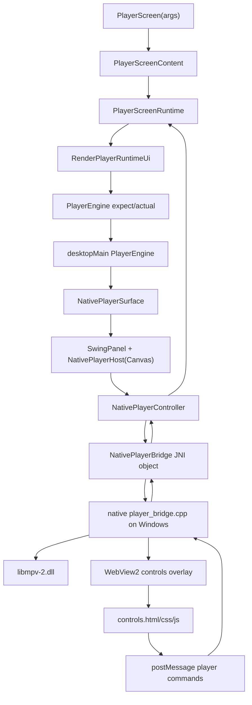
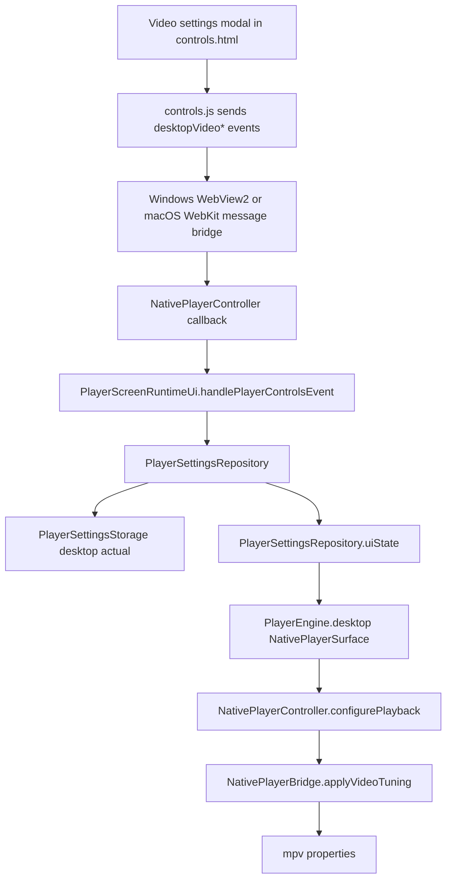

# Desktop player architecture

This document explains how the current Nuvio Desktop player works on the `nuvio-desktop` branch based on `NuvioMedia/NuvioDesktop`. It focuses on Windows because that is the primary runtime target, and it also describes the macOS path where the current native bridge mirrors the same public Kotlin API.

The important mental model is that Desktop playback is not a normal Compose video composable. Compose owns the application state, routing, player decisions, and fallback UI. The actual desktop playback surface is an AWT/Swing host that is handed to a native bridge. The native bridge creates the mpv player and renders the native HTML overlay above it.

## High-level flow



On desktop, the player is split into three layers:

1. Shared Kotlin player runtime: state, source switching, progress, tracks, subtitles, settings, scrobbling, skip prompts, next episode, modal data.
2. Desktop Kotlin bridge layer: Compose-to-Swing embedding, controller lifecycle, JSON serialization, JNI method calls, callbacks into the shared runtime.
3. Native desktop bridge: mpv instance, native window parenting, WebView overlay, fullscreen/window operations, native event loop, mpv property access.

## Main files

Shared player runtime:

- `composeApp/src/commonMain/kotlin/com/nuvio/app/features/player/PlayerScreen.kt`
- `composeApp/src/commonMain/kotlin/com/nuvio/app/features/player/PlayerScreenContent.kt`
- `composeApp/src/commonMain/kotlin/com/nuvio/app/features/player/PlayerScreenRuntimeState.kt`
- `composeApp/src/commonMain/kotlin/com/nuvio/app/features/player/PlayerScreenRuntimeUi.kt`
- `composeApp/src/commonMain/kotlin/com/nuvio/app/features/player/PlayerScreenRuntimeEffects.kt`
- `composeApp/src/commonMain/kotlin/com/nuvio/app/features/player/PlayerScreenRuntimePlaybackActions.kt`
- `composeApp/src/commonMain/kotlin/com/nuvio/app/features/player/PlayerScreenRuntimeSourceActions.kt`
- `composeApp/src/commonMain/kotlin/com/nuvio/app/features/player/PlayerScreenRuntimeTrackActions.kt`
- `composeApp/src/commonMain/kotlin/com/nuvio/app/features/player/PlayerScreenRuntimeSubtitleActions.kt`
- `composeApp/src/commonMain/kotlin/com/nuvio/app/features/player/PlayerEngine.kt`

Desktop Kotlin layer:

- `composeApp/src/desktopMain/kotlin/com/nuvio/app/features/player/PlayerEngine.desktop.kt`
- `composeApp/src/desktopMain/kotlin/com/nuvio/app/features/player/desktop/NativePlayerHost.kt`
- `composeApp/src/desktopMain/kotlin/com/nuvio/app/features/player/desktop/NativePlayerController.kt`
- `composeApp/src/desktopMain/kotlin/com/nuvio/app/features/player/desktop/NativePlayerBridge.kt`
- `composeApp/src/desktopMain/kotlin/com/nuvio/app/features/player/desktop/DesktopAppFullscreen.kt`
- `composeApp/src/desktopMain/kotlin/com/nuvio/app/features/player/desktop/DesktopWindowChrome.kt`
- `composeApp/src/desktopMain/kotlin/com/nuvio/app/features/player/desktop/MacosAwtViewResolver.kt`

Native layer:

- `composeApp/src/desktopMain/native/windows/player_bridge.cpp`
- `composeApp/src/desktopMain/native/macos/player_bridge.mm`
- `composeApp/src/desktopMain/native/windows/runtime/libmpv-2.dll`
- `composeApp/src/desktopMain/native/windows/runtime/WebView2Loader.dll`

Overlay resources:

- `composeApp/src/desktopMain/resources/player-ui/controls.html`
- `composeApp/src/desktopMain/resources/player-ui/controls.css`
- `composeApp/src/desktopMain/resources/player-ui/controls.js`

## Shared runtime

`PlayerScreen` is the public entry point. It receives arguments such as media identity, stream URL, source metadata, resume position, callbacks, and external player hooks. It delegates almost immediately into `PlayerScreenContent`.

`PlayerScreenContent` creates and remembers a `PlayerScreenRuntime`. The runtime is not just UI state. It is the central coordinator for playback identity, current source, source lists, episodes, player settings, subtitle state, watch progress, Trakt scrobbling, P2P consent, next episode logic, skip intro state, and player overlay state.

The runtime is intentionally split into many extension files. That keeps the huge player workflow manageable:

- `PlayerScreenRuntimeState.kt` owns the mutable state container.
- `PlayerScreenRuntimeEffects.kt` wires Compose effects for lifecycle, progress ticks, metadata refreshes, skip prompts, visibility, and cleanup.
- `PlayerScreenRuntimePlaybackActions.kt` owns progress persistence, seek scheduling, Trakt start/stop, and playback identity resets.
- `PlayerScreenRuntimeSourceActions.kt` owns source switching, episode switching, P2P source decisions, and direct stream reuse.
- `PlayerScreenRuntimeTrackActions.kt` owns audio/subtitle track persistence and refresh.
- `PlayerScreenRuntimeSubtitleActions.kt` owns addon subtitles, delay, and auto sync helpers.
- `PlayerScreenRuntimeUi.kt` builds the final UI and handles player-control events.

The shared runtime never talks directly to mpv. It talks through the common `PlayerEngineController` interface from `PlayerEngine.kt`.

## PlayerEngine contract

`PlayerEngine.kt` defines the cross-platform contract:

- `PlayerEngineController`
- `PlayerControlsAction`
- `PlayerControlsState`
- `PlayerEngine` composable
- track models and player snapshot models

`PlayerEngineController` is the imperative API exposed to the shared runtime. It includes:

- playback: `play`, `pause`, `seekTo`, `seekBy`, `retry`, `setPlaybackSpeed`, `setMuted`
- tracks: `getAudioTracks`, `getSubtitleTracks`, `selectAudioTrack`, `selectSubtitleTrack`
- external subtitles: `setSubtitleUri`, `clearExternalSubtitle`, `clearExternalSubtitleAndSelect`
- subtitle styling: `applySubtitleStyle`, `setSubtitleDelayMs`
- platform settings: `configureIosVideoOutput`

Desktop implements this controller with `NativePlayerController`. iOS and Android use their own actual implementations.

`PlayerControlsState` is the state snapshot sent to the native overlay. It contains:

- display labels
- current title, episode, provider, stream title
- playback flags and progress
- source list data
- episode list data
- audio/subtitle tracks
- addon subtitle data
- subtitle styling data
- P2P consent data
- skip/next episode state
- theme colors
- desktop fullscreen state
- desktop MPV tuning values

That state is intentionally platform-neutral, but Desktop consumes much more of it because the native HUD is HTML/JS and needs a serialized view of everything it renders.

## Desktop PlayerEngine

`PlayerEngine.desktop.kt` is the desktop actual implementation.

It chooses between:

- `NativePlayerSurface` for normal native desktop playback.
- `DesktopStubPlayerSurface` as a fallback when native playback is disabled or unavailable.

`NativePlayerSurface` creates:

- `NativePlayerHost`, an AWT `Canvas` used as the native host component.
- `NativePlayerController`, the Kotlin controller that wraps the JNI bridge.

It then embeds the host with Compose `SwingPanel`. This is the critical integration point: Compose owns the layout, but the actual video/control surface is an AWT component. The native bridge resolves the underlying platform handle from that component.

The desktop surface keeps `rememberUpdatedState` wrappers around callbacks so the native controller can call the latest shared runtime callbacks without recreating the native player every recomposition.

The desktop surface also watches `PlayerSettingsRepository.uiState`. When settings change, it updates:

- decoder priority
- NVIDIA RTX Super Resolution toggle
- brightness
- contrast
- saturation
- gamma
- deband
- interpolation

Those values flow into `NativePlayerController.configurePlayback(...)`, which then calls `NativePlayerBridge.applyVideoTuning(...)`.

## NativePlayerHost

`NativePlayerHost` is a small AWT `Canvas`.

Its job is to be the stable native host for the platform bridge. It exposes callbacks for:

- displayability changes
- first paint
- first full-size paint

Those callbacks are used to coordinate launch shielding and avoid revealing half-created native surfaces too early.

The host must stay stable. Destroying and recreating it during resize/fullscreen would be risky because the native bridge parents mpv/WebView to its underlying native handle.

## NativePlayerController

`NativePlayerController` is the Kotlin desktop implementation of `PlayerEngineController`.

It owns:

- the native `handle: Long`
- the latest `PlayerControlsState`
- the latest `PlayerPlaybackSnapshot`
- create/dispose lifecycle
- polling and state updates
- JSON serialization for the overlay
- event dispatch back to `PlayerScreenRuntime`
- track JSON decoding
- calls into `NativePlayerBridge`

When playback starts, `NativePlayerController` calls `NativePlayerBridge.create(...)`. It passes:

- native host component
- source URL
- HTTP headers
- initial position
- play/pause flag
- resize mode
- decoder settings
- callbacks for action/event/scrub/snapshot/error
- controls page URL

After creation, it sends overlay state through:

```kotlin
NativePlayerBridge.updateControls(handle, state.toControlsJson(isFullscreen))
```

`toControlsJson` serializes `PlayerControlsState` by hand. This is deliberate: the overlay bridge expects a compact plain JSON string and avoids pulling a full serialization dependency into this hot path.

The controller receives commands in two categories:

- action commands, which map to `PlayerControlsAction` and may be handled by shared runtime.
- event commands, which carry a string plus numeric value and are routed to `handlePlayerControlsEvent`.

The controller handles some commands locally when they are native-only or faster at the bridge layer:

- play/pause toggle
- volume adjustments
- speed cycling
- seek operations
- fullscreen toggle

Everything involving app state, source switching, settings repository, subtitles, P2P consent, or episode logic is routed back to the shared runtime.

## NativePlayerBridge

`NativePlayerBridge.kt` is the JNI wrapper.

It declares external functions for:

- create/dispose
- updating the HTML controls
- play/pause
- seeking
- speed/volume
- duration/position/buffer/loading/ended/paused
- resize mode
- video tuning
- audio/subtitle tracks
- subtitle URL operations
- window chrome and borderless fullscreen
- subtitle delay/style
- WebView2 warmup/shutdown

It also prepares runtime files:

- extracts native libraries from resources when needed
- resolves `libmpv-2.dll`
- extracts `controls.html`, `controls.css`, and `controls.js` to a temp `nuvio-player-ui` directory
- exposes a `file:///.../controls.html` URL to the native bridge

On Windows, the native runtime depends on `libmpv-2.dll`. This branch expects the DLL under the native Windows runtime resources, and the C++ bridge can also search fallback locations or `NUVIO_LIBMPV_PATH`.

## Windows native bridge

`player_bridge.cpp` is the Windows implementation. Its main responsibilities are:

- resolve the AWT `Canvas` HWND
- create native child windows for playback and controls
- load `libmpv-2.dll`
- create and initialize `mpv_handle`
- configure mpv options
- create/use WebView2 for controls
- route WebView messages back to Java/Kotlin callbacks
- poll or read mpv properties for snapshots
- update WebView controls with JSON
- apply fullscreen/window chrome operations
- dispose all native resources in the right order

### mpv loading

The bridge dynamically loads mpv instead of statically linking to it. It resolves exports like:

- `mpv_create`
- `mpv_initialize`
- `mpv_terminate_destroy`
- `mpv_set_option`
- `mpv_set_option_string`
- `mpv_set_property`
- `mpv_set_property_string`
- `mpv_get_property`
- `mpv_command`
- `mpv_wait_event`
- `mpv_wakeup`

If `libmpv-2.dll` is missing or one of these exports is missing, native player creation fails and the error is sent back to the Kotlin runtime.

### mpv rendering

The Windows bridge owns the mpv instance and places video into the native host. It configures mpv with app-controlled behavior:

- no mpv OSC
- app-owned key handling
- keep-open behavior
- hardware decode options
- cache options
- subtitle options
- resize mode mapping
- video tuning

The Compose layer does not render pixels from mpv. It only hosts the native surface and reacts to state.

### WebView2 overlay

The controls overlay is a WebView2 view displaying `controls.html`. It is native, not Compose. It is layered with the video host by the bridge.

The HTML UI receives state by JavaScript evaluation from native code. It sends commands back through WebView messaging:

```js
window.chrome.webview.postMessage({ type, value })
```

The bridge parses the message and calls the Java/Kotlin callback. The callback eventually reaches `NativePlayerController`, then `PlayerScreenRuntimeUi`.

### Fullscreen on Windows

The fullscreen button in the native overlay sends `toggleFullscreen`. `NativePlayerController` routes that to `toggleDesktopAppFullscreen(...)`.

Windows fullscreen is borderless fullscreen, not a separate video window. `DesktopAppFullscreen.kt` stores enough window state to exit fullscreen cleanly. `NativePlayerBridge.setWindowBorderlessFullscreen(...)` calls into the C++ bridge, which changes Win32 window styles and bounds.

The overlay receives `isFullscreen` in `PlayerControlsState.toControlsJson(...)`, so `controls.js` can switch between fullscreen and fullscreen-exit icons.

## Overlay resources

The native player overlay lives in:

- `controls.html`
- `controls.css`
- `controls.js`

This is a self-contained HUD. It is not a web app framework.

### controls.html

The HTML file defines:

- SVG symbols
- opening overlay
- header controls
- fullscreen buttons
- back/close buttons
- video settings button
- playback error UI
- pause metadata overlay
- parental guide
- skip prompt
- next episode card
- transport controls
- progress and volume
- locked overlay
- modals for audio, subtitles, sources, video settings, episodes, submit intro, and P2P consent

The important detail is that modal markup is static. JS fills it with current state and toggles visibility.

### controls.css

CSS defines the HUD look and interaction states. The official style is dark, compact, glass-like, and control-dense. Modals use the shared `.modal-layer` and `.track-panel` pattern.

When adding desktop player UI, fit into these existing rules:

- use existing panel/header/action classes where possible
- keep modal width bounded with `min(92vw, ...)`
- keep controls keyboard/mouse friendly
- keep mobile/small-window media queries
- avoid separate visual systems

### controls.js

`controls.js` owns the overlay behavior:

- stores the latest `state`
- renders labels, buttons, lists, modals, tracks, subtitles, sources, episodes
- handles chrome auto-hide
- handles cursor hiding
- sends commands to native
- updates fullscreen icons
- handles slider and keyboard input
- sends scrub updates separately from normal commands

It can send messages through two bridge shapes:

- `window.webkit.messageHandlers.player` for macOS/WebKit
- `window.chrome.webview` for Windows/WebView2

This allows the same overlay code to work on Windows and macOS.

## Desktop MPV settings added here

The desktop MPV tuning path is:



The settings currently exposed in the native HUD are:

- deband
- frame interpolation
- brightness
- contrast
- saturation
- gamma
- reset tuning

The values are persisted in `PlayerSettingsRepository` and platform storage, not in the overlay. The overlay is only a view/controller.

The sliders use mpv's `-50..50` range. Kotlin also clamps these values in the repository. That means a malformed JS event cannot push out-of-range values into storage.

## Source switching

The native overlay can open source and episode modals. The workflow is:

1. User clicks Sources or Episodes in the native HUD.
2. `controls.js` opens the corresponding modal immediately.
3. It sends `sources`, `episodes`, `reloadSources`, `selectSource`, `selectEpisode`, or related events.
4. `PlayerScreenRuntimeUi.handlePlayerControlsEvent` receives the event.
5. Shared runtime prepares source lists or episode lists.
6. Source switching is handled in `PlayerScreenRuntimeSourceActions.kt`.
7. The runtime updates current source URL and metadata.
8. The desktop `PlayerEngine` receives a changed source URL.
9. The native controller recreates or reconfigures playback as needed for the new source.

This is why settings and source logic should stay in Kotlin runtime. The HTML overlay should not decide stream identity or resolve URLs.

## Track and subtitle flow

Audio/subtitle tracks are queried through `NativePlayerController.getAudioTracks()` and `getSubtitleTracks()`. These call `NativePlayerBridge.audioTracksJson(...)` and `subtitleTracksJson(...)`, then decode the returned JSON into common track models.

Track selection goes the other direction:

- overlay sends a select event
- Kotlin resolves selected UI row to mpv track id
- bridge calls native track selection
- runtime persists preference where appropriate

External subtitles and addon subtitles are shared-runtime features. The desktop controller exposes:

- `setSubtitleUri`
- `clearExternalSubtitle`
- `clearExternalSubtitleAndSelect`
- `setSubtitleDelayMs`
- `applySubtitleStyle`

The native bridge applies those values to mpv.

## Watch progress and lifecycle

Watch progress is owned by the shared runtime, not native mpv. The controller provides snapshots:

- playing/paused
- loading
- ended
- duration
- position
- buffered position
- speed

The runtime persists progress on ticks, seeks, close/back, source changes, and lifecycle transitions. This is why native close/back events must route back through the runtime instead of directly disposing mpv without notifying Kotlin.

The native controller disposal should be treated as high risk. It must avoid:

- losing the last progress flush
- leaving mpv handles alive
- leaving WebView2/native windows alive
- sending callbacks into a disposed runtime

## Opening overlay and first paint

Desktop native surfaces can show black/uninitialized frames while mpv and WebView are being created. The current code uses:

- `NativePlayerHost` first-paint callbacks
- launch shield logic
- opening overlay data in `PlayerControlsState`

The goal is to make startup look intentional while native resources become ready.

Do not remove these guards just because playback works locally. They prevent visible flicker and half-created native windows on slower machines.

## macOS bridge theory and current shape

macOS uses the same Kotlin `NativePlayerBridge` API, but the native implementation is `player_bridge.mm`.

At a high level, macOS does the same jobs as Windows:

- resolve the native AWT host as an `NSView`
- create and own an mpv instance
- render mpv through a native view/layer path
- create a WebKit overlay for controls
- send overlay messages back to Kotlin
- apply resize, tracks, subtitles, tuning, and fullscreen-related state

Important differences:

- Windows uses HWND and WebView2.
- macOS uses NSView/Cocoa and WebKit-style messaging.
- macOS rendering uses Objective-C++ and platform display/color-space APIs.
- Fullscreen behavior is not Win32 borderless fullscreen; it must respect Cocoa window/fullscreen semantics.

The shared overlay JS intentionally supports both message bridges:

- `window.chrome.webview` on Windows.
- `window.webkit.messageHandlers.player` on macOS.

That means most HUD UI additions should be written once in `controls.html/css/js` and only need native changes if they require a new bridge method.

For the MPV tuning settings added here, macOS already has an `applyVideoTuning` native entry point in the bridge shape, so the UI and Kotlin state model can remain shared with Windows.

## GIF/static image handling from the old branch

The old `feat/mediamp-sg-rework` branch had a much larger desktop image pipeline, including custom GIF decode/cache work and Windows still-image decoding experiments. That does not fit directly into the current official desktop branch without replacing too much of the official image stack.

The compatible part that was worth keeping is the product behavior:

- collection folders can have a static cover URL and a focus GIF URL
- the static cover should remain the static image
- the GIF should only be used when animation is requested
- when animation is not active, do not use the GIF as the static fallback, because that risks displaying the first frame of the GIF instead of the intended cover

The current implementation keeps the official `CollectionCardRemoteImage` expect/actual pattern and passes:

- `imageUrl` for the static cover
- `animatedImageUrl` for the GIF
- `animateIfPossible` as the switch

Desktop and Android still rely on Coil. iOS keeps its existing native GIF path but now receives the GIF URL separately.

## Rules for future changes

Follow these rules when modifying the desktop player:

1. Keep official `NuvioMedia/NuvioDesktop` code as the baseline.
2. Do not merge old desktop branches wholesale.
3. Add missing behavior through existing official seams: `PlayerControlsState`, `NativePlayerController`, `NativePlayerBridge`, and `controls.*`.
4. Keep stream/source/episode decisions in shared Kotlin runtime.
5. Keep the HTML overlay as a view/controller only.
6. Do not destroy/recreate native render resources for normal resize/fullscreen fixes without evidence.
7. Treat fullscreen, source switching, back/close cleanup, progress flush, subtitles, audio tracks, and mpv tuning as high-risk.
8. Validate with `git diff --check`, `node --check controls.js`, `compileKotlinDesktop`, and `desktopMainClasses`.
9. Runtime-test playback/fullscreen/settings manually before claiming user-visible playback behavior is fully verified.

## Debugging map

If the button is visible but does nothing:

- check `controls.html` has `data-command`
- check `controls.js` handles that command before the generic `send(command, 0)`
- check native WebView messages reach `NativePlayerController`
- check `handlePlayerControlsEvent` or `handlePlayerControlsAction`

If overlay labels are wrong:

- check `PlayerControlsState`
- check `PlayerScreenRuntimeUi` fills the field
- check `toControlsJson`
- check `controls.js` reads the same JSON key

If mpv settings do not apply:

- check repository values update
- check `PlayerEngine.desktop.kt` observes `PlayerSettingsRepository.uiState`
- check `NativePlayerController.configurePlayback`
- check `NativePlayerBridge.applyVideoTuning`
- check native bridge properties for brightness/contrast/saturation/gamma/deband/interpolation

If source switching breaks:

- check source modal event names in JS
- check `handlePlayerControlsEvent`
- check `prepareSourcesForPlayerControls`
- check `switchToSource` or `switchToEpisodeStream`
- check progress flush before source replacement

If fullscreen desyncs:

- check `toggleFullscreen` event path
- check `DesktopAppFullscreen.kt`
- check `NativePlayerBridge.setWindowBorderlessFullscreen`
- check `isDesktopAppFullscreen(...)`
- check `isFullscreen` in `toControlsJson`
- check `syncFullscreenButtons()` in JS

If GIF cards show the wrong still image:

- check `HomeCollectionRowSection.collectionFolderCardImageUrl`
- check `collectionFolderCardAnimatedImageUrl`
- check `CollectionCardRemoteImage` actual implementation
- confirm static `coverImageUrl` and animated `focusGifUrl` are separate

## Validation status for this doc snapshot

This documentation snapshot was written after validating:

- `node --check composeApp/src/desktopMain/resources/player-ui/controls.js`
- `git diff --check`
- `rg "<<<<<<<|=======|>>>>>>>" .`
- `./gradlew.bat :composeApp:compileKotlinDesktop --no-daemon`
- `./gradlew.bat :composeApp:desktopMainClasses --no-daemon`

Manual playback testing is still required to prove runtime behavior on a real Windows session with an actual stream.
