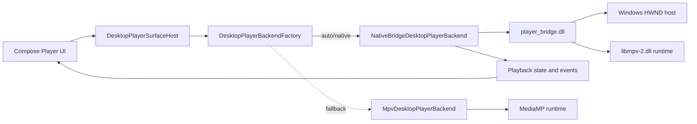

# Windows Native Player

This branch moves Windows desktop playback toward the NuvioMedia native-first model without removing the existing MPV/MediaMP fallback.

## Backend Selection

Windows backend selection is controlled by:

```text
nuvio.desktop.player.backend=auto|native|mpv|none
NUVIO_DESKTOP_PLAYER_BACKEND=auto|native|mpv|none
```

Legacy names are still accepted for compatibility:

```text
nuvio.windows.player.backend
NUVIO_WINDOWS_PLAYER_BACKEND
```

Selection order:

1. `auto` tries the native bridge first, then falls back to MPV/MediaMP.
2. `native` tries only the native bridge.
3. `mpv` uses MPV/MediaMP directly.
4. `none` disables Windows playback.

Forced `native` can be allowed to fall back with:

```text
nuvio.desktop.player.nativeFallback=true
NUVIO_DESKTOP_PLAYER_NATIVE_FALLBACK=true
```

## Native Bridge Runtime

The official Windows bridge name is:

```text
player_bridge.dll
```

The loader searches in this order:

1. Explicit override file or directory:
   `nuvio.player.bridge.path` / `NUVIO_PLAYER_BRIDGE_PATH`
2. Packaged runtime locations:
   `app/native`, `native/windows`, and the launcher directory
3. Local build locations:
   `composeApp/build/native/windows`, `build/native/windows`, and `WindowsBridge/build/*`
4. Java/JNA library path

`NUVIO_DEV_PLAYER_LOOKUP` is no longer required for the native bridge to be used in a packaged runtime.

## Packaging

`packageWindowsNativeRuntime` still prepares the Windows `app/native` runtime used by the current app image. It now also:

- runs `buildWindowsPlayerBridge` before packaging;
- copies the native bridge as `player_bridge.dll` when available;
- writes `runtime-files.txt` for diagnostics;
- preserves the existing MPV/MediaMP DLL packaging as fallback.

`buildWindowsPlayerBridge` builds `composeApp/src/desktopMain/native/windows/player_bridge.cpp` to `composeApp/build/native/windows/player_bridge.dll`. The current source is a native MPV bridge: it creates a child Windows video host, loads `libmpv-2.dll` dynamically, and exposes the JNA ABI consumed by the Desktop backend.

To require a native bridge during packaging:

```text
nuvio.windows.player.bridge.required=true
NUVIO_WINDOWS_PLAYER_BRIDGE_REQUIRED=true
```

If the bridge is not available and the requirement flag is not set, packaging continues with MPV fallback files and logs a warning.

If MSVC is not auto-detected, pass:

```text
nuvio.windows.vcvars.path=C:\path\to\vcvars64.bat
NUVIO_WINDOWS_VCVARS_PATH=C:\path\to\vcvars64.bat
```

## Diagnostics

Useful log facts to check:

- selected backend request and source;
- native bridge load diagnostics;
- MPV fallback reason;
- packaged `player_bridge.dll` source path;
- generated `runtime-files.txt` contents.

## Architecture



## Current Scope

This is an intermediate alignment pass. It promotes the Windows native bridge path to the primary backend, aligns runtime lookup/packaging names with NuvioMedia, and provides an autonomous `player_bridge.dll`. The local player contracts still expose a different control and state pipeline from NuvioMedia's `NativePlayerSurface`/WebView controls layer, so that controller layer remains the next structural port.
